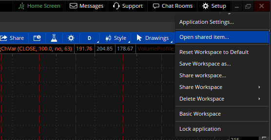
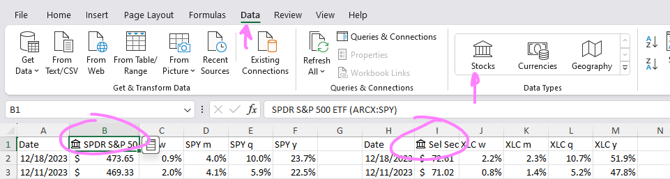
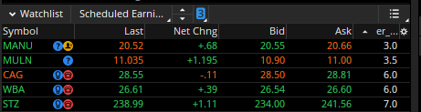

# weekly-trading-homework

Tools and utilities to help get starting performing weekly trading homework. 

**USE AT YOUR OWN RISK**: [These materials are released under MIT license unless otherwise noted.](LICENSE) None of these tools will help you get rich quick. They provide an overview in the general market action that you can take 20 minutes a week to look at to provide yourself with a reference to what is is going on in a small section of the stock market.

## Contributions

If you have other resources you look at each week, I would love to add them to the list. I want to ensure that anything added to the list is free / low cost and is not predictive or prescriptive in nature. Feel free to make a Pull Request or create an Issue with the resource. 

## Tools

* [Excel](https://www.office.com/)
* [thinkorswim](https://www.schwab.com/trading/thinkorswim)
* [Python](https://www.python.org/)

You can load any of the thinkorswim resources with the `Open Shared item...` menu option under `Setup` in the upper right.

## Contents

| Resource | Description |
| --- | ---------------------- |
| [thinkorswim Swing Chart (IWM)](http://tos.mx/HdaqUxy) | Get a reference to the levels and recent price action of IWM. |
| [thinkorswim Volatility Chart (RVX)](http://tos.mx/91xLD9x) | Check where volatility has been clustering / moving lately and in the recent past. |
| [thinkorswim Breadth Chart](http://tos.mx/yzH2mzL) | Look at the general disposition of the market |
| Volatility Cones | Get a reference to the current state of IV compared to HV along different timeframes. Not included as current code is using the thinkorswim developer API which you can no longer get an API key. The API will be disabled soon and I will have to figure out a new way to get this data... or if it is even worth the time. I will add this in the the repository if I update the code in a way that others can use. | 
| [sectors Excel Sheet](sectors.xlsx) | Displays different sectors and relative performance. Can easily be changed to use any symbol that Excel supports by changing the instruments on the top of the data tab (B1, I1 and so on). I usually make them stock data types using the data ribbon. Requires subscription to Office 365.   |
| [global_equities Excel Sheet](global_equities.xlsx) | Copy and paste of sectors Excel sheet with different tickers that I like to compare with each other. |
| [thinkorswim Weeklies with Earnings Scan](http://tos.mx/hhCQlH0) | Scan for instruments that  - have earnings coming up  - have weekly options  - liquid |
| [thinkorswim Days to Earnings Report (er_days)](http://tos.mx/wTGX9rH) | Used with the Weeklies with Earnings Scan to sort the list in the watchlist. Import the script and use the customize wheel on the top right of the watchlist widget.     |
| [CME FedWatch Tool](https://www.cmegroup.com/markets/interest-rates/cme-fedwatch-tool.html) | Gives current market generated probabilities for Interest Rates |

